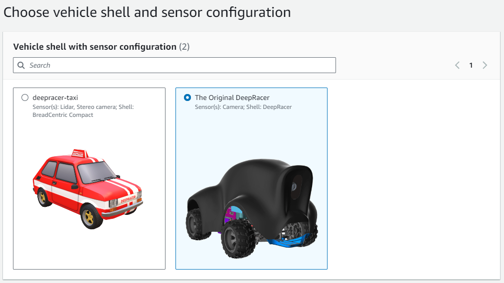

{}
이 장에서는 30분 훈련 완성을 위한 방법을 설명합니다.
자료는 이 [링크](https://falktan.medium.com/aws-deepracer-how-to-train-a-model-in-15-minutes-a07ab77fb793)를 참고하였습니다.
{}

## AWS Deepracer — How to train a model in 15 minutes

작성자는 차량의 조향 방향을 사용하여 스코어링 함수를 설계했습니다.

* 차량 주위에 트랙 너비 만큼의 원을 그린다.
* 이 원과 중앙선의 교점을 찾는다.
* 그 점을 향해 조향하면 최대 점수를 얻고, 조향이 다를수록 점수가 감소한다.
* Discount factor 는 `0.5` 를 사용한다.
* 이렇게 훈련한 모델은 `15분` 훈련으로 주행률 100% 를 달성할 수 있었습니다.


{}
위의 문서에서는 `15분` 훈련을 했지만, 우리는 Discount factor 를 `0.9` 로 변경 하였기에 `30분` 훈련으로 진행 합니다.
{}

## Create model

AWS Console 의 `Deepracer` 서비스로 이동합니다. `Your models` 메뉴에서 `Create model` 을 클릭합니다.


`Model name` 을 입력 합니다. 저는 `ch-ccw-00` 으로 입력했습니다.


`Track` 은 `Smile Speedway` 를 선택합니다.


`Track direction` 은 `Counterclockwise` 를 선택합니다.


`Next` 를 클릭합니다.

`Hyperparameters` 의 `Discount factor` 에 `0.9` 를 입력합니다.


`Next` 를 클릭합니다.

`Select action space` 에서 `Discrete action space` 을 선택합니다.


`Steering angle granularity` 에 `7` 을 선택합니다.

`Speed granularity` 에 `1` 을 선택합니다.

`Maximum speed` 에 `1.4` 를 입력합니다.

`Action list` 는 총 7개의 액션이 되어야 합니다.


`Next` 를 클릭합니다.

차량은 `The Original DeepRacer` 를 선택합니다.



`Next` 를 클릭합니다.

`Reward function` 에 다음의 코드를 입력합니다.

```python
import math


SIGHT = 0.9

MAX_REWARD = 3.0
MIN_REWARD = 0.0001


def dist(point1, point2):
    return ((point1[0] - point2[0]) ** 2 + (point1[1] - point2[1]) ** 2) ** 0.5


# thanks to https://stackoverflow.com/questions/20924085/python-conversion-between-coordinates
def rect(r, theta):
    """
    theta in degrees
    returns tuple; (float, float); (x,y)
    """

    x = r * math.cos(math.radians(theta))
    y = r * math.sin(math.radians(theta))
    return x, y


# thanks to https://stackoverflow.com/questions/20924085/python-conversion-between-coordinates
def polar(x, y):
    """
    returns r, theta(degrees)
    """

    r = (x ** 2 + y ** 2) ** 0.5
    theta = math.degrees(math.atan2(y, x))
    return r, theta


def angle_mod_360(angle):
    """
    Maps an angle to the interval -180, +180.
    Examples:
    angle_mod_360(362) == 2
    angle_mod_360(270) == -90
    :param angle: angle in degree
    :return: angle in degree. Between -180 and +180
    """

    n = math.floor(angle / 360.0)

    angle_between_0_and_360 = angle - n * 360.0

    if angle_between_0_and_360 <= 180.0:
        return angle_between_0_and_360
    else:
        return angle_between_0_and_360 - 360


def get_waypoints_ordered_in_driving_direction(params):
    # return get_center_waypoints()

    # waypoints are always provided in counter clock wise order
    if params["is_reversed"]:  # driving clock wise.
        return list(reversed(params["waypoints"]))
    else:  # driving counter clock wise.
        return params["waypoints"]


def up_sample(waypoints, factor=10):
    """
    Adds extra waypoints in between provided waypoints
    :param waypoints:
    :param factor: integer. E.g. 3 means that the resulting list has 3 times as many points.
    :return:
    """
    p = waypoints
    n = len(p)

    return [
        [
            i / factor * p[int((j + 1) % n)][0] + (1 - i / factor) * p[j][0],
            i / factor * p[int((j + 1) % n)][1] + (1 - i / factor) * p[j][1],
        ]
        for j in range(n)
        for i in range(factor)
    ]


def get_target_point(params):
    waypoints = up_sample(get_waypoints_ordered_in_driving_direction(params), 20)

    car = [params["x"], params["y"]]

    distances = [dist(p, car) for p in waypoints]
    min_dist = min(distances)
    i_closest = distances.index(min_dist)

    n = len(waypoints)

    waypoints_starting_with_closest = [waypoints[(i + i_closest) % n] for i in range(n)]

    r = params["track_width"] * SIGHT

    is_inside = [dist(p, car) < r for p in waypoints_starting_with_closest]
    i_first_outside = is_inside.index(False)

    if i_first_outside < 0:
        # this can only happen if we choose r as big as the entire track
        return waypoints[i_closest]

    return waypoints_starting_with_closest[i_first_outside]


def get_target_steering_degree(params):
    tx, ty = get_target_point(params)
    car_x = params["x"]
    car_y = params["y"]
    dx = tx - car_x
    dy = ty - car_y
    heading = params["heading"]

    _, target_angle = polar(dx, dy)

    steering_angle = target_angle - heading

    return angle_mod_360(steering_angle)


def score_speed(params):
    speed = params["speed"]

    max_speed = 2.5

    score = speed / max_speed

    return max(min(score, MAX_REWARD), MIN_REWARD)


def score_steer_to_point_ahead(params):
    best_stearing_angle = get_target_steering_degree(params)
    steering_angle = params["steering_angle"]

    speed = params["speed"]

    error = (
        steering_angle - best_stearing_angle
    ) / 60.0  # 60 degree is already really bad

    score = 1.0 - abs(error)

    return max(min(score, MAX_REWARD), MIN_REWARD)


def reward_function(params):
    reward = 0.0

    reward += score_steer_to_point_ahead(params)

    # reward += score_speed(params)

    return float(reward)
```

함수가 잘 작성되었는지 확인하기 위해 `Validate` 를 클릭합니다.


`Stop conditions` 의 `Maximum time` 에 `30` 을 입력합니다.


다음 설정들은 모두 체크를 해제 합니다.


`Create model` 을 클릭합니다.

초기화가 완료 되면 훈련을 시작 할 것 입니다.


{}
훈련이 진행 되는 동안 보상 함수를 분석해 봅시다.
{}

## Trainning

훈련이 진행되는 동안 `Reward graph` 와 `Simulation video stream` 을 확인 할 수 있습니다.


이미 15분 경 평가 100% 를 달성했고, 30분 훈련을 완료하였습니다.


## Evaluation

`Evaluation` 탭으로 이동합니다.

`Start evaluation` 을 클릭합니다.


`Evaluation Name` 을 입력합니다. 저는 `ccw-01` 으로 입력했습니다.


`Evaluate criteria` 에서 트랙은 `Smile Speedway` 를 선택합니다.


`Track direction` 은 `Counterclockwise` 를 선택합니다.


`Start evaluation` 을 클릭합니다.

평가가 진행되는 동안 `Simulation video stream` 와 `Evaluation results` 을 확인 할 수 있습니다.


평가가 완료 되었습니다. `Simulation video stream` 에서 주행 영상을 확인 할 수 있습니다.


