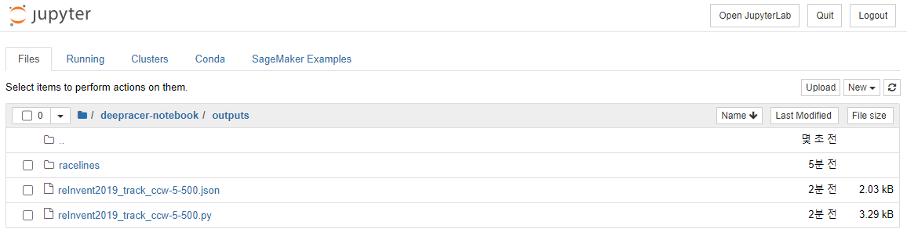

주피터 노트북에서 `RaceLine_ActionSpace.ipynb` 노트북을 클릭합니다.

Kernel은 `coda_python3` 를 선택하고, 노트북을 `Trust` 합니다.

아래 셀에서 `TRACK_NAME` 이 `reInvent2019_track_ccw-5-500` 인지 확인 합니다.

이전에 선택했던 설정 `TRACK_NAME`, `XI_ITERATIONS`, `LINE_ITERATIONS` 을 조합한 이름입니다.

`LOOK_AHEAD_POINTS` 는 얼마나 멀리 앞을 볼 것인지를 결정합니다.

`MIN_SPEED`, `MAX_SPEED` 는 최소, 최대 속도를 결정합니다.

`MIN_SPEED`, `R_STEERING` 은 좌우 최대 핸들 각도입니다.

`ACTION_SPACE_SIZE` 는 스피드와 핸들 각도를 몇 개로 나눌 것인지를 결정합니다.

`⏩` 버튼을 클릭하면 전체 셀이 실행됩니다.

추출한 데이터는 `deepracer-workshop/outputs/` 폴더에 저장됩니다.

