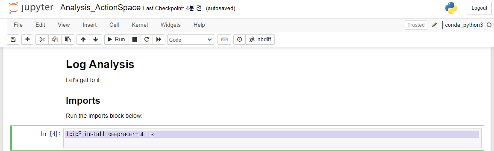
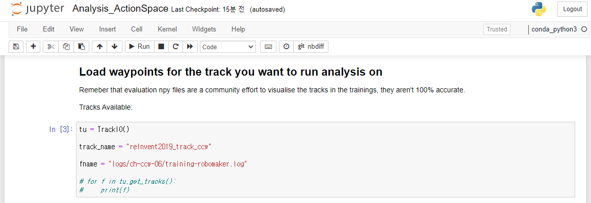
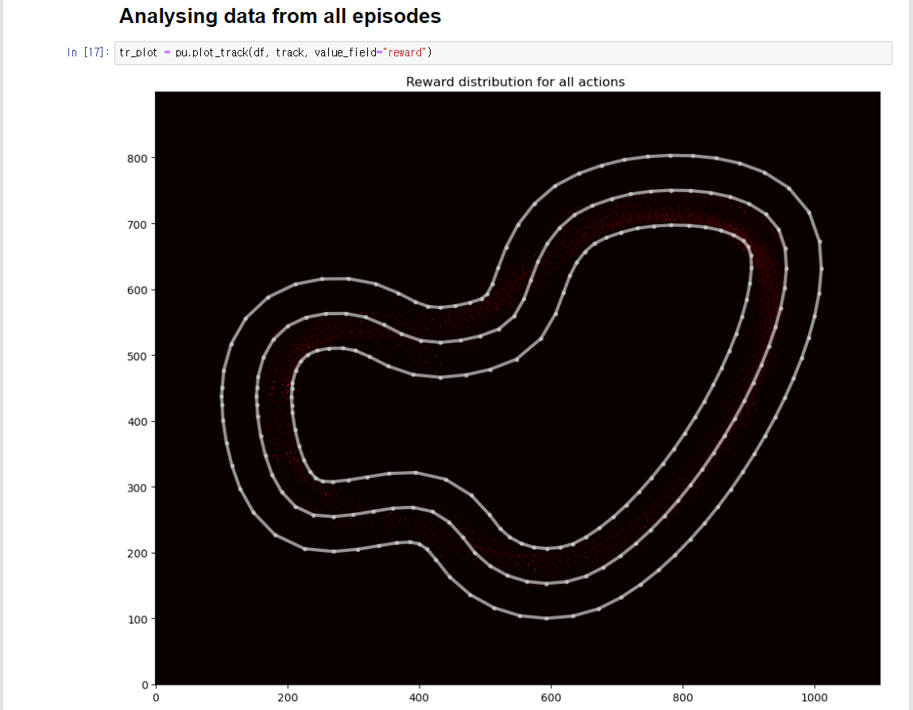
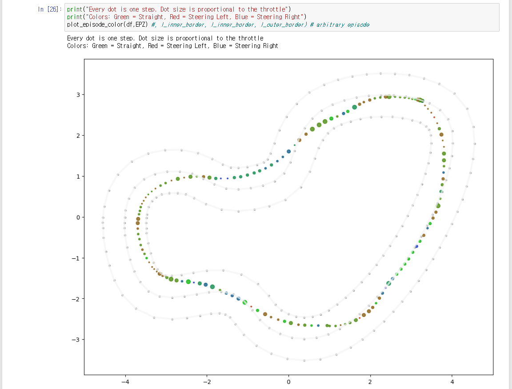
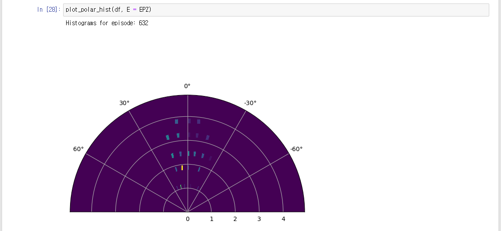

## Download logs

분석 하고자 하는 모델 에서 `Download logs` 를 클릭하여 주행 로그를 다운로드 합니다.

## Analysis ActionSpace

주피터 노트북에서 `Analysis_ActionSpace.ipynb` 노트북을 클릭합니다.

Kernel은 `coda_python3` 를 선택하고, 노트북을 `Trust` 합니다.

처음에는 사용하는 라이브러리가 설치되어있지 않습니다. 첫 셀의 주석을 풀고 `▶️ Run` 을 실행합니다.

## Run all cells

아래 셀에서 `track_name` = `reInvent2019_track_ccw` 를 확인 합니다.

`fname` = `logs/training-robomaker.log` 를 확인 합니다.

`⏩` 버튼을 클릭하면 전체 셀이 실행됩니다.

