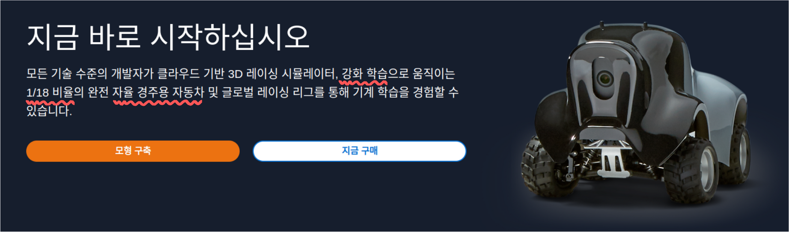
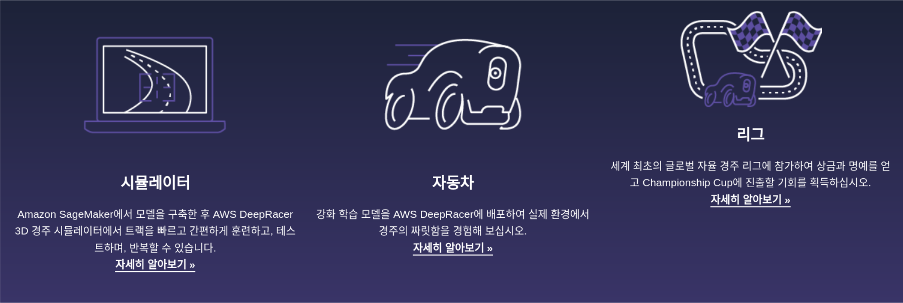
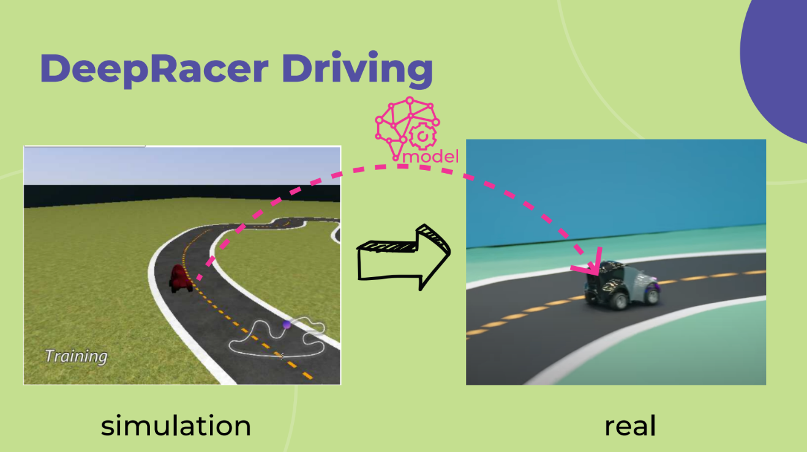
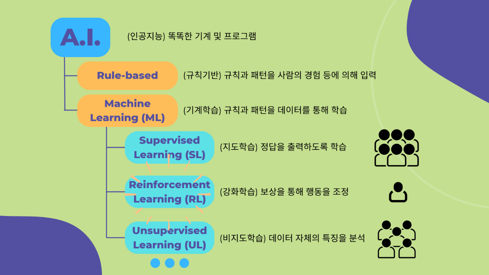
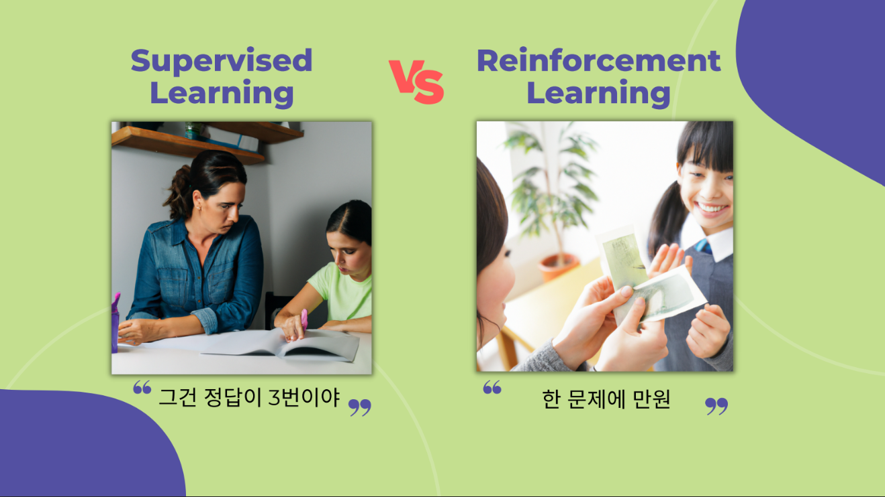
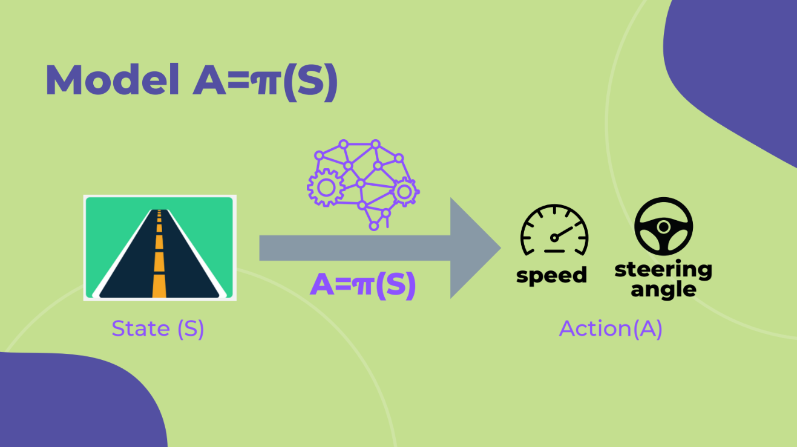
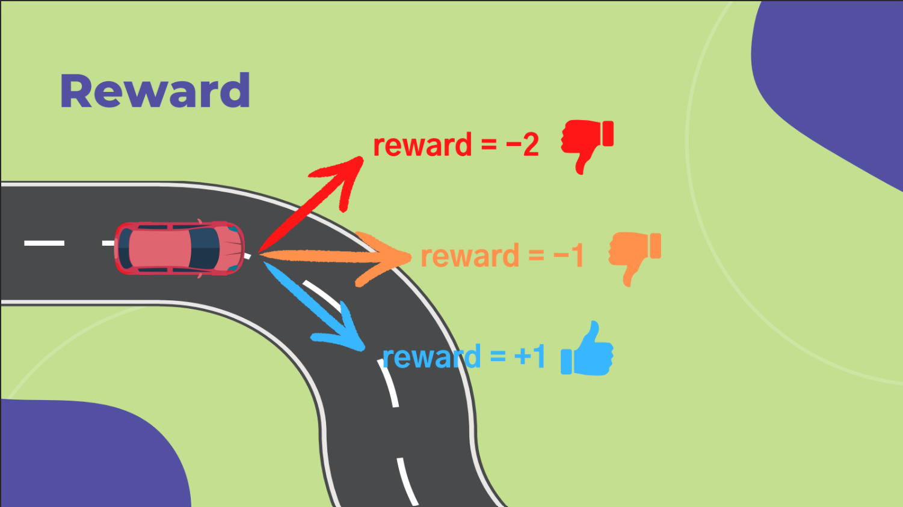
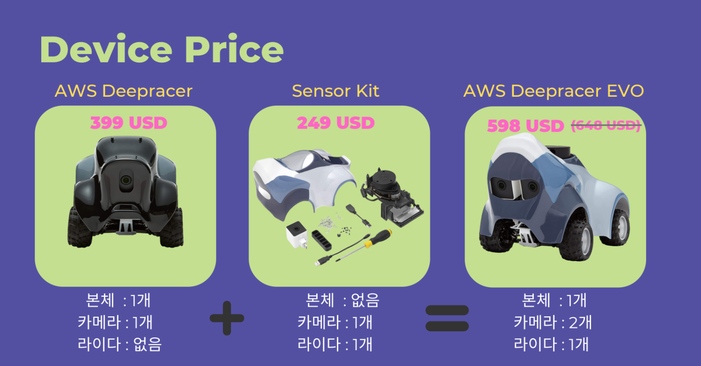
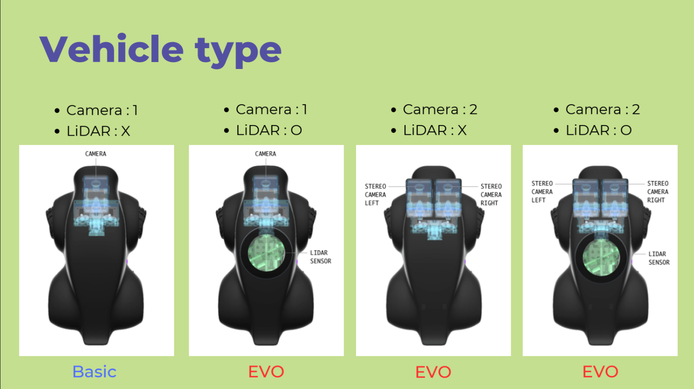
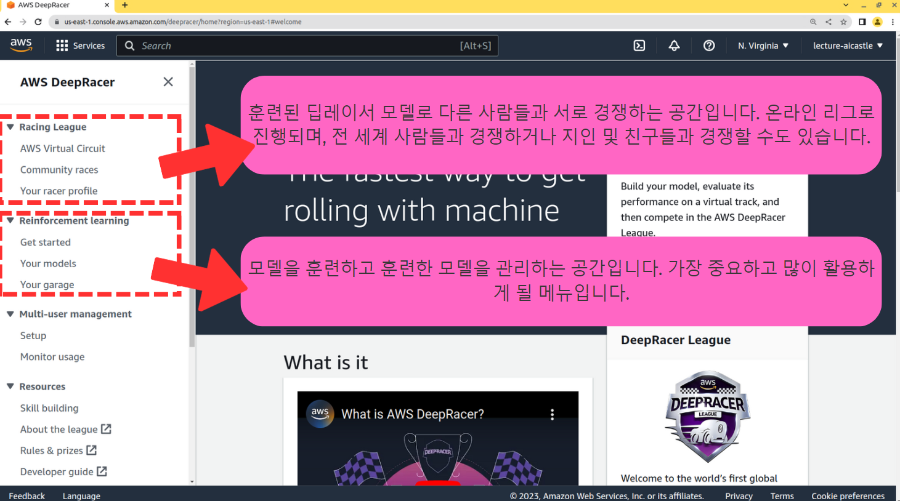

## What is AWS Deepracer

DeepRacer 소개 홈페이지 : <https://aws.amazon.com/deepracer>

DeepRacer는 **강화학습** 기계학습 알고리즘으로 훈련되어 작동하는 **1/18 비율의 자율주행 자동차**를 경험할 수 있는 서비스입니다. 

{}
강화학습 (Reinforcement Learning, RL)은 인공지능 기계학습 분야 중 하나로 보상(Reward)을 통해 기계를 학습시키는 독특한 방식의 알고리즘입니다. 강화학습의 대표적인 예로 알파고와 GPT 등이 있습니다.
{}

DeepRacer에서 제공하는 서비스로 크게 시뮬레이터, 자동차, 리그로 나누어 볼 수 있습니다.

1. **시뮬레이터** : 딥레이서 모델을 훈련시키기 위해서는 가상의 시뮬레이션 공간이 필요합니다. 이러한 시뮬레이션 공간을 손쉽게 구성할 수 있습니다.

2. **자동차** : 1/18 비율의 실제 자동차를 구매하여 훈련된 모델을 테스트해 볼 수 있습니다.

3. **리그** : 딥레이서에서는 매월 온라인 리그(Virtual Circuit)가 개최되며, 여기서 우수한 성적을 얻은 참가자는 Re:invent 챔피언십 리그에 참가할 자격이 주어집니다.

## Deepracer Workflow

DeepRaecr로 자율주행 자동차를 만드는 과정은 다음과 같습니다.

먼저, 시뮬레이션 공간에서 강화학습 알고리즘으로 모델을 훈련시킵니다. 시뮬레이션 공간에서 모델을 훈련시키는 이유는 모델 훈련의 효율성을 높이고 실제 세상의 위험 요소들을 회피하기 위함입니다.

이렇게 훈련된 모델을 실제 차량에 업로드하여 자율주행 자동차가 완성됩니다.

{}
"Sim2real"은 "simulation to real-world"의 줄임말로, 인공 지능이나 로봇 공학 등에서 사용되는 용어로, 인공적으로 만들어진 시뮬레이션 환경에서 훈련된 모델이 실제 세계에서 잘 작동하는지 확인하기 위한 프로세스를 뜻합니다. 시뮬레이션 환경과 실제 세계는 매우 다르기 때문에, 시뮬레이션에서 잘 동작하는 모델이 실제 세계에서도 잘 작동하는지 보장할 수는 없습니다.
{}

## Reinforcement Learning

DeepRacer 모델을 훈련시키는 알고리즘인 강화학습(Reinforcement Learning, RL)에 대해 알아보겠습니다. 우선, 인공지능 및 기계학습의 종류에대해 간략히 알아보겠습니다.

인공지능 알고리즘은 크게 규칙기반(Rule-based)과 기계학습(Machine Learning, ML) 분야로 나뉘어집니다. 규칙기반은 규칙과 패턴을 사람의 경험 등에 의해 입력된 형태를 의미하고, 기계학습은 규칙과 패턴을 데이터를 통해 학습하는 형태를 의미합니다.

기계학습(Machine Learning, ML)은 크게 지도학습(Supervised Leaning, SL), 강화학습(Reinforcement Learning, RL), 비지도학습(Unsupervised Learning, UL)
로 나뉘어 집니다.

1. 지도학습 (Supervised Leaning, SL)
  - 기계에게 사람이 직접 정답을 알려주는 형태의 알고리즘으로 가장 많이 활용되는 기계학습 분야입니다.
  - 일반적으로 잘 학습되지만 라벨링(사람이 정답을 매기는 과정) 과정이 다소 번거롭습니다.

2. 강화학습 (Reinforcement Learning, RL)
  - 보상을 통해 기계의 행동을 학습시키는 알고리즘입니다. 예를들어, 기계가 잘 하면 높은 점수(보상)를 주고 잘 못하면 낮은 점수(처벌)를 주면서 기계를 학습시킵니다.
  - 라벨링이 필요없다는 장점을 가지지만 지도학습만큼 잘 학습이 되지 않습니다.

3. 비지도학습 (Unsupervised Learning, UL)
  - 데이터 자체의 특징과 패턴을 분석하는 분야입니다. 지도학습과 강화학습은 input에 따른 output을 학습시키는 것이 중점이라면 비지도학습은 데이터 내부적 패턴을 찾는 것이 주요 관심사입니다.
  - 이후 섹션인 **최적 코스 추출** 및 **최적 속도 추출** 과정이 비지도학습에 해당됩니다.

지도학습 (Supervised Learning)은 마치 부모가 직접 수학을 공부하여 자녀에게 정답을 알려주는 방식과 유사합니다.

반면에 강화학습 (Reinforcement Learning)은 부모가 수학을 몰라도 용돈(보상)을 통해 자녀에게 수학을 학습시키는 방식과 유사합니다.

딥레이서 모델은 센서 데이터 (예를들면, 카메라에 찍힌 사진)를 입력 받아서 속도와 핸들 각도를 출력하는 구조로 되어있습니다.

일반적으로 입력값을 S (State)라고 표현하고 출력값을 A (Action)이라고 표현합니다.

딥레이서 모델이 여러분의 마음에 드는 Action (속도 및 핸들 각도)을 출력한다면 높은 보상을 주고 마음에 들지 않는 다면 낮은 보상을 주면 됩니다.

모델은 학습을 통해 높은 보상이 나오는 쪽으로 Action을 강화합니다. 반면 낮은 보상이 나오는 Action은 학습을 통해 점차 약화됩니다.

{}
강화학습에서 기계에게 보상을 줄 때 사람이 매번 하나하나 주는 것은 매우 번거로운 일입니다. 따라서 보상 함수(Reward Function)를 작성하여 보상을 주는 원칙을 정하고 이를 자동화하는 방식을 사용합니다.
{}

{}
DeepRacer는 초당 15프레임의 촬영을 합니다. 즉, 1초에 15번씩 카메라에 찍힌 사진(S)을 모델에 입력하여 속도 및 핸들 각도 (A)를 출력하며 각각의 행동에 대해 매번 보상함수를 통해 보상을 얼마나 줄 지를 결정합니다.
{}

## Types of sensors and vehicles

DeepRacer에서 사용되는 센서의 종류는 카메라(Camera)와 2D 라이다(LiDAR)입니다. 카메라는 최대 2개까지 장착 가능하며, 2D 라이다로 최대 1개 장착할 수 있습니다.

딥레이서 실제 차량을 구매할 때, 센서의 수와 종류에 따라 금액이 달라집니다. 기본 차량의 경우 카메라 1개만 포함되어 있으며, 추가적으로 센서킷을 구매하면 카메라 2개와 라이다 1개로 EVO 차량을 만들 수 있습니다.

센서의 종류에 따라 위와 같이 차량의 타입을 4가지로 구분할 수 있습니다. 

일반적으로 전방의 장애물을 감지하기 위해서 카메라 2대를 사용합니다. (원근감을 위해서) 

또한 후방에서 다가오는 차량을 감지하기 위해서 라이다를 활용합니다.

참고로 시뮬레이션에서 훈련된 모델의 차량의 타입(센서의 개수 및 종류)이 실제 차량에서의 타입과 동일해야만 실제 차량에서 정상적으로 모델을 작동시킬 수 있습니다.

{}
"처리할 데이터의 양"과 "학습 속도"는 서로 Trade-off 관계입니다. 즉, 어느 한쪽이 이득을 얻으면 다른 한쪽은 손해를 봐야합니다. 센서의 수가 많아지면, 처리할 데이터량이 많아지고 학습 속도는 급격히 저하됩니다.반대로 센서의 수가 적으면, 처리할 데이터량이 적어지고 학습 속도는 급격히 올라갑니다.
{}

## AWS DeepRacer Console

딥레이서 콘솔 : <https://us-east-1.console.aws.amazon.com/deepracer/home>

위의 딥레이서 콘솔 링크를 통해 딥레이서 모델을 훈련시키고 관리할 수 있습니다.

좌측 메뉴 중에서 가장 중요한 섹션인 `Racing League`와 `Reinforcement Learning`에 대해서 중점적으로 알아보겠습니다.

- `Racing League` 섹션
  - `AWS Virtual Circuit` : 전 세계 사람들과 함께 경쟁하는 리그 공간
  - `Community races` : 지인 및 친구들과 함께 경쟁하는 공간
  - `Your racer profile` : 자신의 레이싱 프로필을 관리

- `Reinforcement Learning` 섹션
  - `Get started` : 모델 훈련을 시작하는 공간
  - `Your models` : 훈련된 모델을 관리하는 공간
  - `Your garage` : 차량을 생성 및 관리하는 공간

{}
본 섹션 (딥레이서 기초)은 [DeepRacer School](https://deepracer-school-ko.ai-castle.com)의 일부 내용을 저작권자의 허락에 따라 참조하여 제작되었습니다.
{}