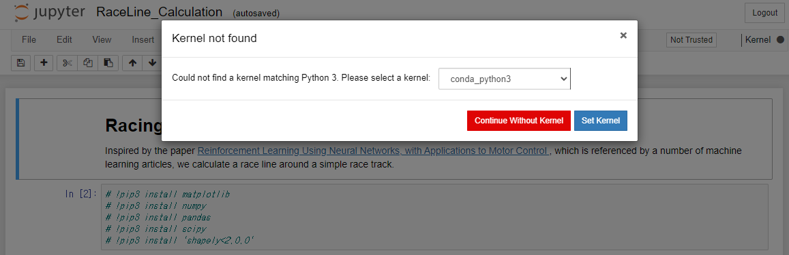

주피터 노트북에서 `RaceLine_Calculation.ipynb` 노트북을 클릭합니다.

처음에는 Kernel이 설정되어있지 않은데 `coda_python3` 를 선택하고 `Set Kernel` 버튼을 클릭합니다.

또한 처음에는 `Not Trusted` 상태인데 버튼을 클릭하고, `Trust` 를 클릭합니다.

처음에는 사용하는 라이브러리가 설치되어있지 않습니다. 첫 셀의 주석을 풀고 `▶️ Run` 을 실행합니다.

해당 셀의 왼쪽에 `In [*]` 가 `In [1]` 로 바뀌면 실행이 완료된 것입니다. 다시 주석 처리합니다.

아래 셀에서 `TRACK_NAME` 이 `reInvent2019_track_ccw` 인지 확인 합니다.

`XI_ITERATIONS` = `5` 이고, `LINE_ITERATIONS` = `500` 입니다. 이 값은 적절하게 조정할 수 있습니다.

`⏩` 버튼을 클릭하면 전체 셀이 실행됩니다.

지정한 iteration 만큼의 시뮬레이션을 실행하고, 최적의 코스를 추출합니다.

추출한 데이터는 `deepracer-group/notebook/outputs/racelines/` 폴더에 저장됩니다.

