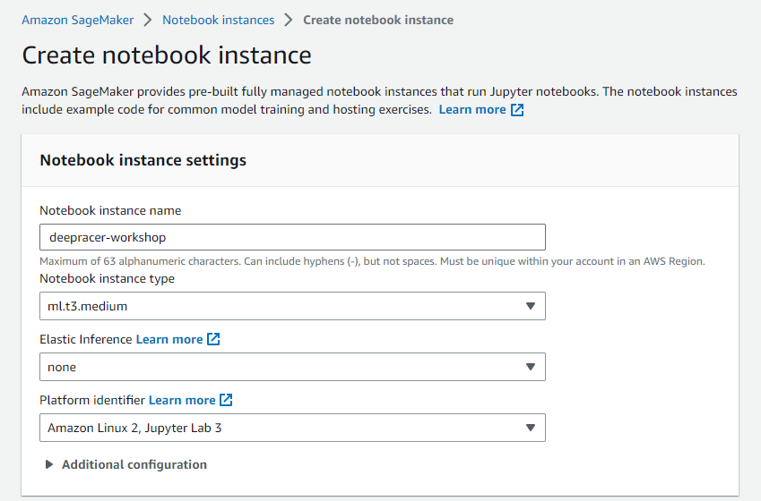
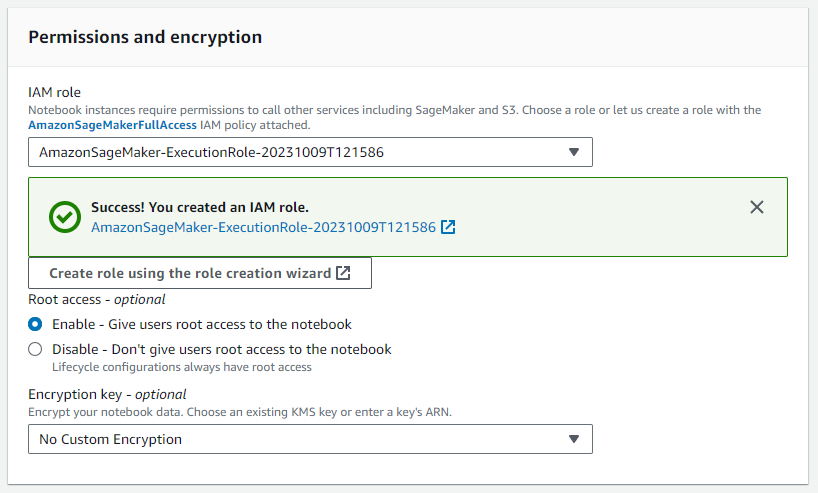
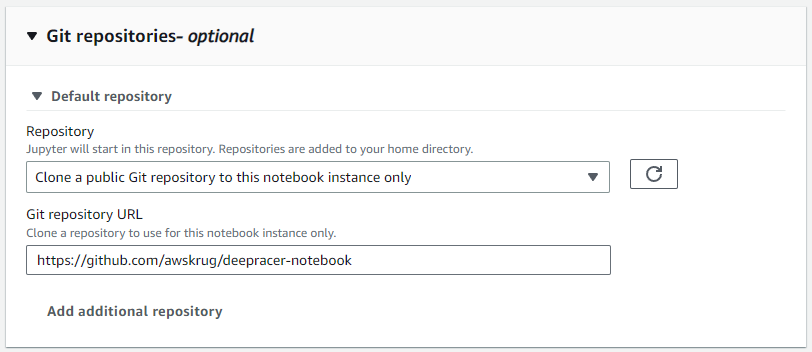
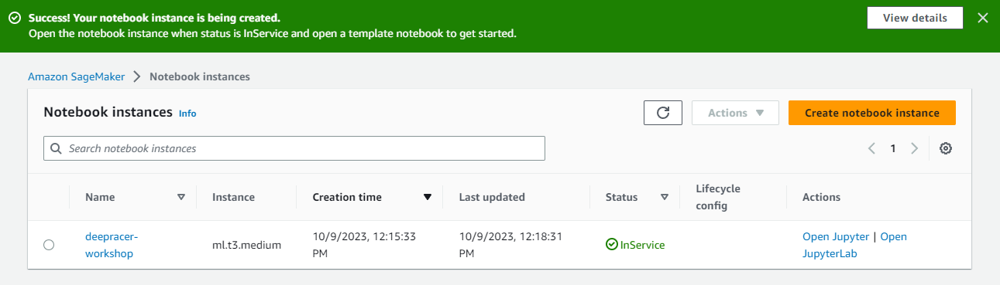
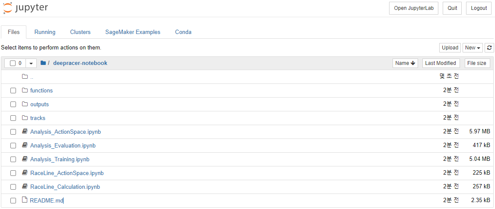

AWS Console에서 SageMaker 서비스로 이동합니다.

리전은 `ap-northeast-2`를 선택합니다.

좌측 메뉴에서 `노트북 인스턴스`를 선택합니다.

{}
바로가기: [링크](https://ap-northeast-2.console.aws.amazon.com/sagemaker/home?region=ap-northeast-2#/notebook-instances)
{}

우측 상단의 `Create notebook instance` 버튼을 클릭합니다.

`Notebook instance settings` 섹션에서 `Notebook instance name` 에 `deepracer-workshop` 을 입력합니다.

`Permissions and encryption` 섹션에서 `IAM role` 을 `Create a new role` 로 선택합니다.

`Create role` 버튼을 클릭합니다.

`Git repositories- optional` 섹션을 열고 `Clone a public Git repository...` 를 선택합니다.

`Git repository URL` 에 `https://github.com/awskrug/deepracer-group` 을 입력합니다.

`Create notebook instance` 버튼을 클릭합니다.

{}
노트북 인스턴스 생성에는 5분 정도 소요됩니다.
{}

만들어진 노트북 인스턴스에서 `Open Jupyter` 링크를 클릭합니다.

주피터 노트북이 열리면 `notebook` 폴더를 클릭합니다.

