{}
이 보상함수는 [링크](https://github.com/dgnzlz/Capstone_AWS_DeepRacer) 를 참고 하였습니다.
{}

## Capstone_AWS_DeepRacer

주피터 노트북에서 `deepracer-group/functions/ct.py` 파일을 클릭합니다.

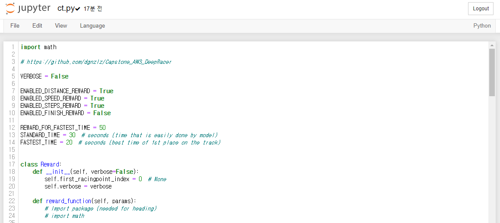

파이선 파일 266번째 줄에 있는 `racing_track` 변수를 `deepracer-group/notebook/outputs/reInvent2019_track_ccw-5-500.py` 의 내용으로 수정합니다.

`STANDARD_TIME` 은 일반으로 완주 했을때의 시간입니다.

`FASTEST_TIME` 은 최고 기록을 세운 시간입니다.

이제 이 함수로 훈련을 시작해 보겠습니다.

## Create model

AWS Console 의 `Deepracer` 서비스로 이동합니다. `Your models` 메뉴에서 `Create model` 을 클릭합니다.


`Model name` 을 입력 합니다. 저는 `ch-ccw-01` 으로 입력했습니다.

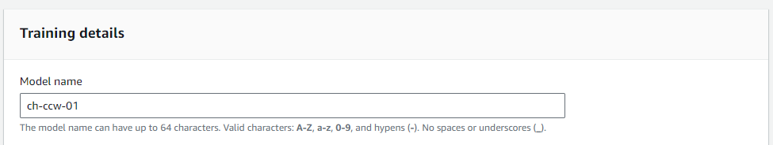

`Track` 은 `Smile Speedway` 를 선택합니다.

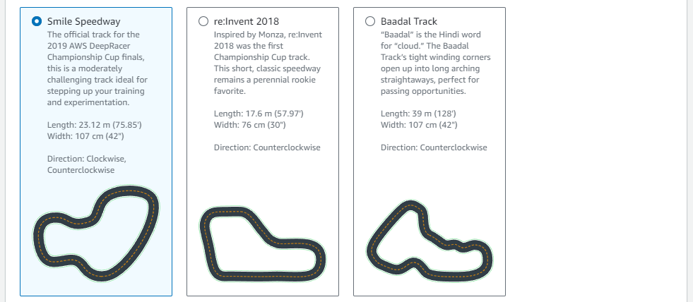

`Track direction` 은 `Counterclockwise` 를 선택합니다.

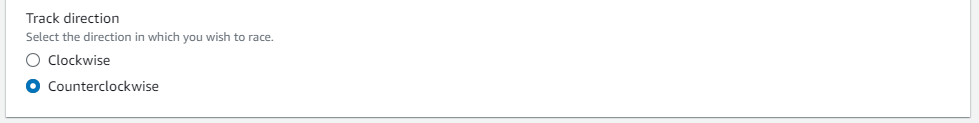

`Next` 를 클릭합니다.

`Hyperparameters` 의 `Discount factor` 에 `0.95` 를 입력합니다.

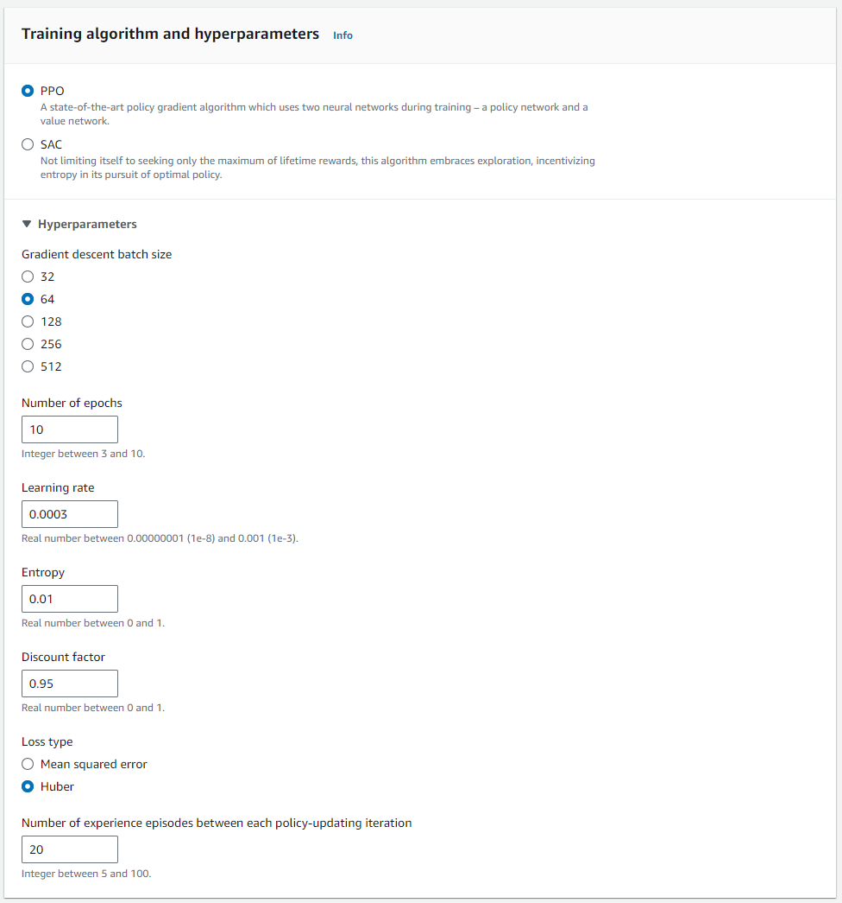

`Next` 를 클릭합니다.

`Select action space` 에서 `Discrete action space` 을 선택합니다.


`Define discrete action space` 에서 다음을 설정 합니다.

`Steering angle granularity` = `7`

`Speed granularity` = `3`

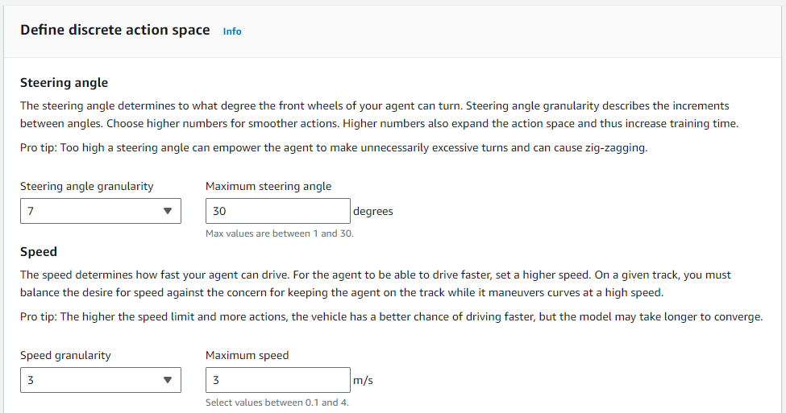

`Action list` 에서 `Advanced configuration` 을 선택합니다.

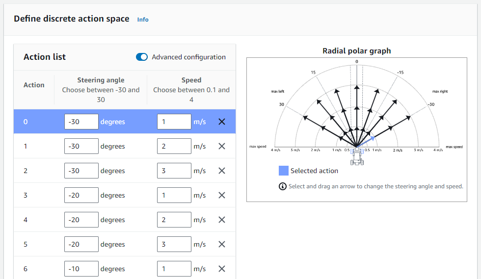

`Add an action` 을 클릭하여 9개의 액션을 추가합니다. 총 30개의 액션이 되어야 합니다.

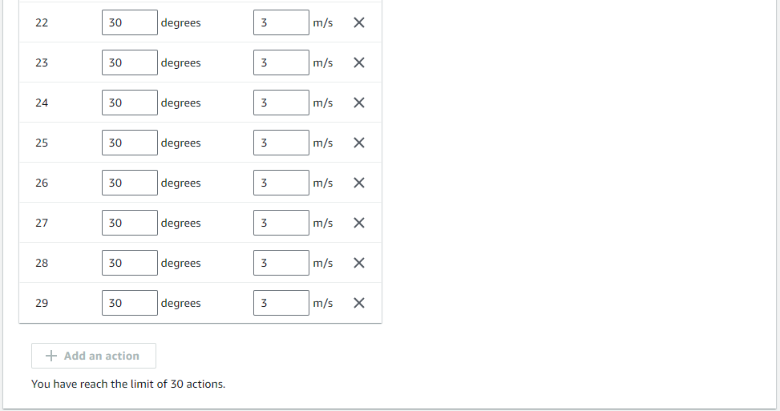

이제 `Steering angle` 과 `Speed` 에 다음과 같은 값을 입력합니다.

```json
[
  { "steering_angle": -30.0, "speed": 1.1, "index": 0 },
  { "steering_angle": -24.0, "speed": 1.1, "index": 1 },
  { "steering_angle": -24.0, "speed": 1.8, "index": 2 },
  { "steering_angle": -24.0, "speed": 2.5, "index": 3 },
  { "steering_angle": -16.0, "speed": 1.1, "index": 4 },
  { "steering_angle": -16.0, "speed": 1.8, "index": 5 },
  { "steering_angle": -16.0, "speed": 2.5, "index": 6 },
  { "steering_angle": -16.0, "speed": 3.2, "index": 7 },
  { "steering_angle": -8.0, "speed": 1.1, "index": 8 },
  { "steering_angle": -8.0, "speed": 1.8, "index": 9 },
  { "steering_angle": -8.0, "speed": 2.5, "index": 10 },
  { "steering_angle": -8.0, "speed": 3.2, "index": 11 },
  { "steering_angle": -8.0, "speed": 3.9, "index": 12 },
  { "steering_angle": 0.0, "speed": 3.9, "index": 13 },
  { "steering_angle": 0.0, "speed": 3.2, "index": 14 },
  { "steering_angle": 0.0, "speed": 2.5, "index": 15 },
  { "steering_angle": 0.0, "speed": 1.8, "index": 16 },
  { "steering_angle": 8.0, "speed": 3.9, "index": 17 },
  { "steering_angle": 8.0, "speed": 3.2, "index": 18 },
  { "steering_angle": 8.0, "speed": 2.5, "index": 19 },
  { "steering_angle": 8.0, "speed": 1.8, "index": 20 },
  { "steering_angle": 8.0, "speed": 1.1, "index": 21 },
  { "steering_angle": 16.0, "speed": 3.2, "index": 22 },
  { "steering_angle": 16.0, "speed": 2.5, "index": 23 },
  { "steering_angle": 16.0, "speed": 1.8, "index": 24 },
  { "steering_angle": 16.0, "speed": 1.1, "index": 25 },
  { "steering_angle": 24.0, "speed": 2.5, "index": 26 },
  { "steering_angle": 24.0, "speed": 1.8, "index": 27 },
  { "steering_angle": 24.0, "speed": 1.1, "index": 28 },
  { "steering_angle": 30.0, "speed": 1.1, "index": 29 }
]
```

`Next` 를 클릭합니다.

차량은 `The Original DeepRacer` 를 선택합니다.

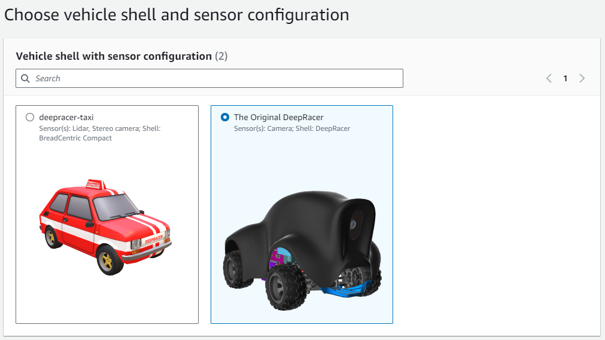

`Next` 를 클릭합니다.

`Reward function` 에 처음의 코드를 입력합니다.

함수가 잘 작성되었는지 확인하기 위해 `Validate` 를 클릭합니다.

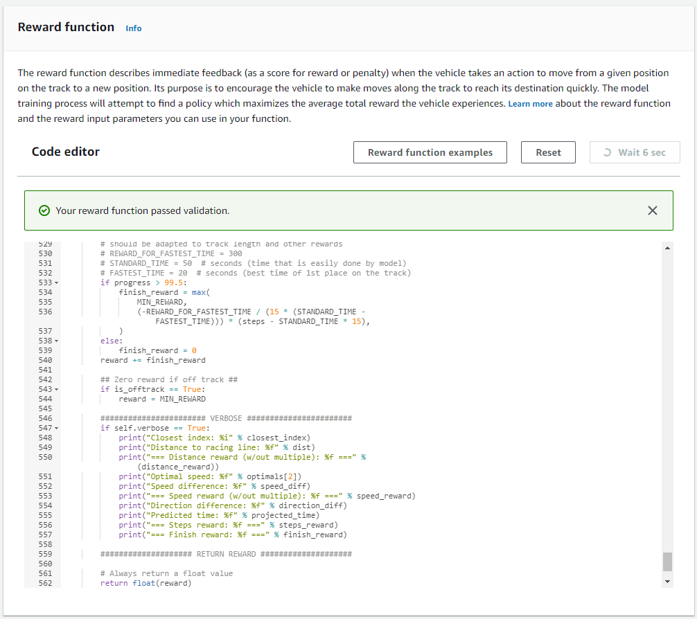

`Stop conditions` 의 `Maximum time` 에 `200` 을 입력합니다.

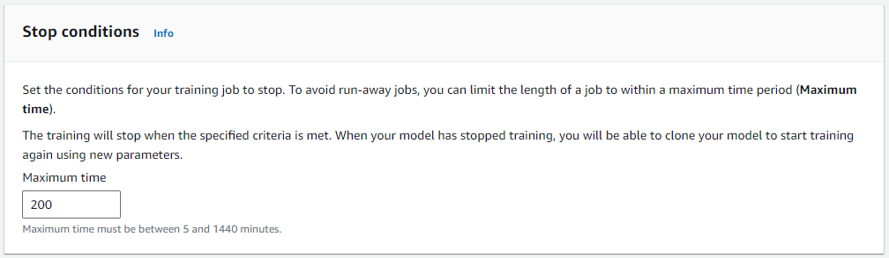

다음 설정들은 모두 체크를 해제 합니다.

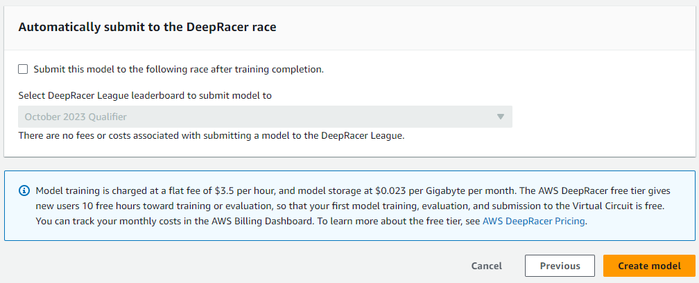

`Create model` 을 클릭합니다.

초기화가 완료 되면 훈련을 시작 할 것 입니다.

## Trainning

200분 훈련을 완료하였습니다. 아마도 다음과 같은 그래프가 나올 것 입니다.

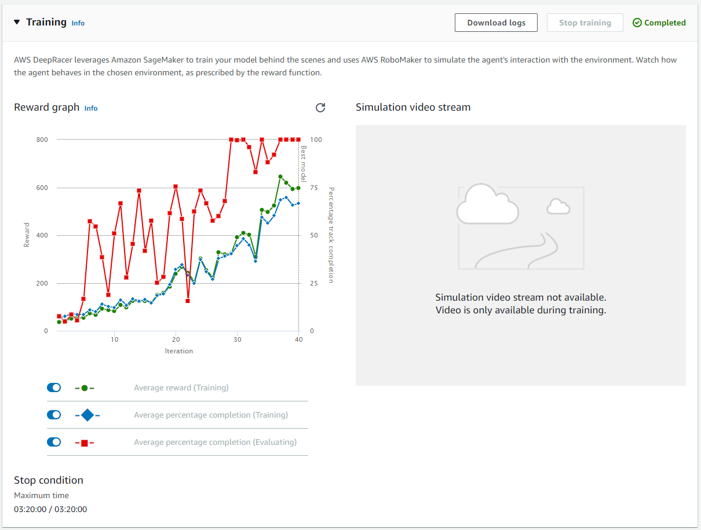
