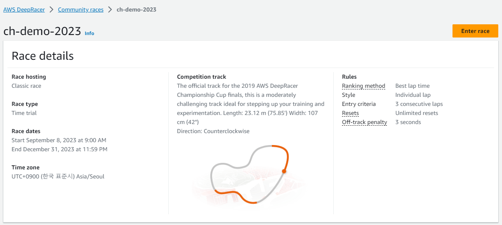
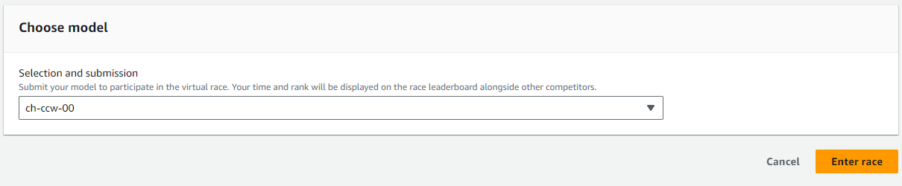

## Online league

AWS Console 의 `Deepracer` 서비스로 이동합니다. `Community races` 메뉴에서 `Create race` 를 클릭하여 새 레이스를 만들수 있지만. 우리는 이미 만들어진 레이스로 이동 합니다.

다음 [링크](https://us-east-1.console.aws.amazon.com/deepracer/home#raceToken/1rjv14XXSGiTOhCfDJvMCA) 를 클릭하여 레이스로 이동합니다.

## Submit model

`Enter race` 버튼을 클릭합니다.

`Choose model` 에서 `ch-ccw-00` 을 선택합니다.

`Enter race` 버튼을 클릭합니다.
