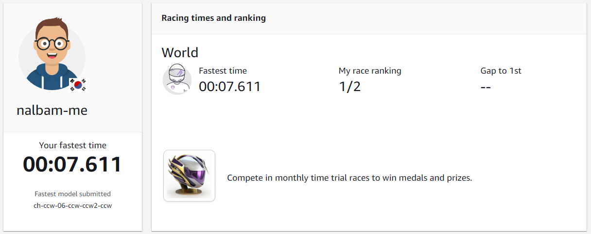
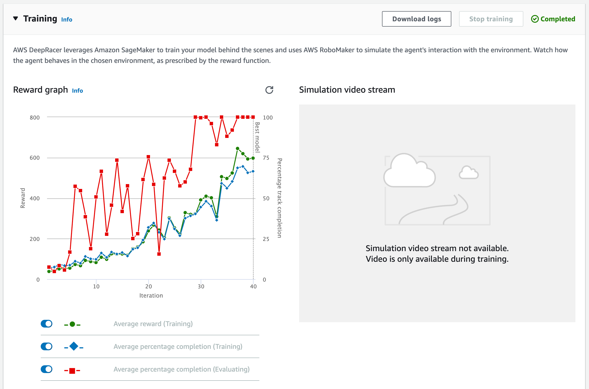
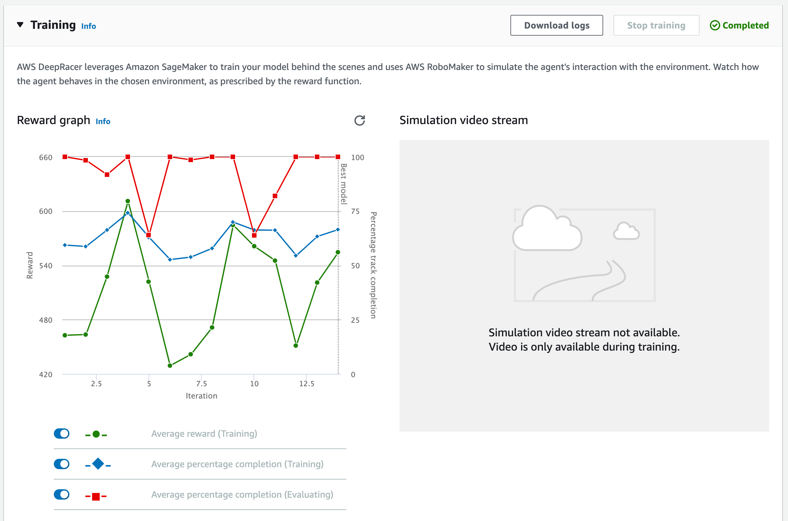
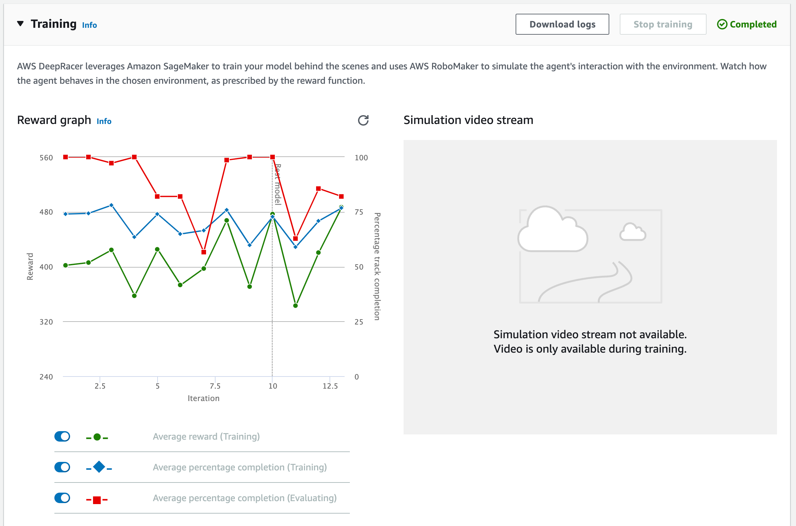
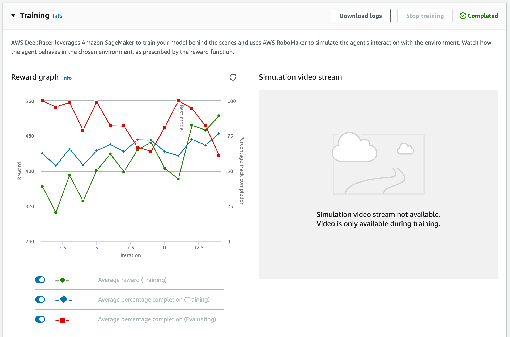

{}
이 장에서는 Best lap time 이 `07.611` 인 모델을 기준으로 설명합니다.
{}

## ch-ccw-06

주피터 노트북에서 `RaceLine_ActionSpace.ipynb` 노트북을 클릭합니다.

`MIN_SPEED` = `1.1`, `MAX_SPEED` = `3.6` 을 입력합니다.

결과를 `racing_track` 변수에 저장합니다.

AWS Console 의 `Deepracer` 서비스로 이동합니다. `Your models` 메뉴에서 `Create model` 을 클릭합니다.

이전과 같은 방법으로 모델을 훈련 합니다.

보상함수: <https://github.com/awskrug/deepracer-notebook/blob/main/functions/ch-ccw-06.py>

## ch-ccw-06-ccw

주피터 노트북에서 `RaceLine_ActionSpace.ipynb` 노트북을 클릭합니다.

`MIN_SPEED` = `1.3`, `MAX_SPEED` = `3.9` 를 입력합니다.

결과를 `racing_track` 변수에 저장합니다.

`Your models` 에서 `ch-ccw-06` 모델을 선택합니다.

`Clone` 을 클릭합니다.

`Hyperparameter` 의 `Learning rate`	= `0.0002` 으로 변경합니다.

모델을 훈련 합니다.

보상함수: <https://github.com/awskrug/deepracer-notebook/blob/main/functions/ch-ccw-06-ccw.py>

## ch-ccw-06-ccw-ccw2

주피터 노트북에서 `RaceLine_ActionSpace.ipynb` 노트북을 클릭합니다.

`MIN_SPEED` = `1.6`, `MAX_SPEED` = `4.0` 을 입력합니다.

결과를 `racing_track` 변수에 저장합니다.

`Your models` 에서 `ch-ccw-06-ccw` 모델을 선택합니다.

`Clone` 을 클릭합니다.

`Hyperparameter` 의 `Learning rate`	= `0.0001` 으로 변경합니다.

모델을 훈련 합니다.

보상함수: <https://github.com/awskrug/deepracer-notebook/blob/main/functions/ch-ccw-06-ccw-ccw2.py>

## ch-ccw-06-ccw-ccw2-ccw

보상함수는 이전 것을 그대로 사용 합니다.

`Your models` 에서 `ch-ccw-06-ccw-ccw2` 모델을 선택합니다.

`Clone` 을 클릭합니다.

`Hyperparameter` 의 `Learning rate`	= `0.00005` 으로 변경합니다.

모델을 훈련 합니다.

