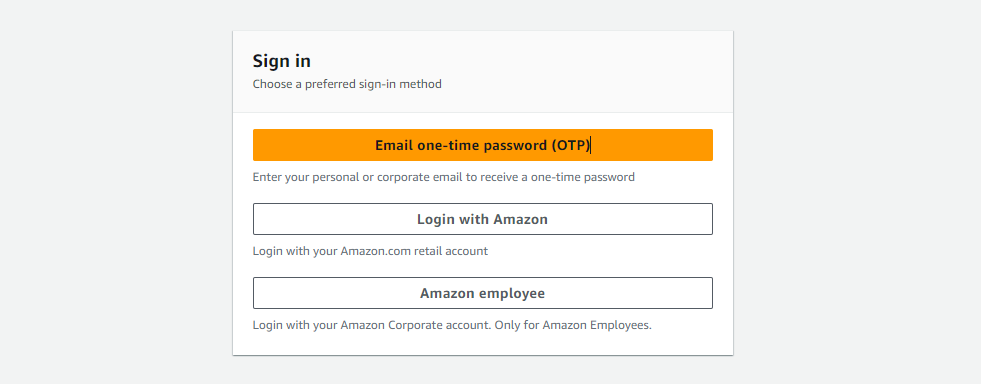
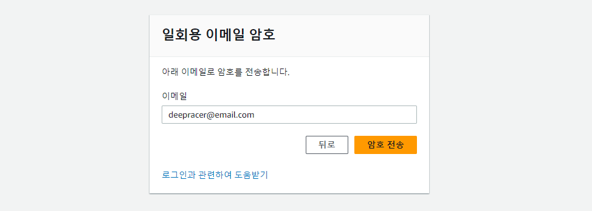
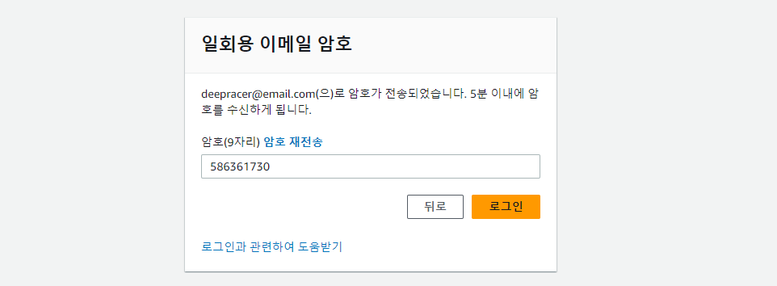
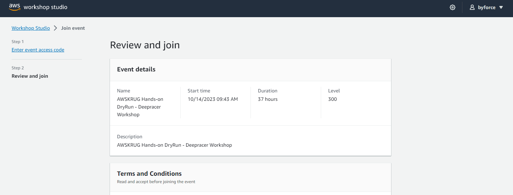
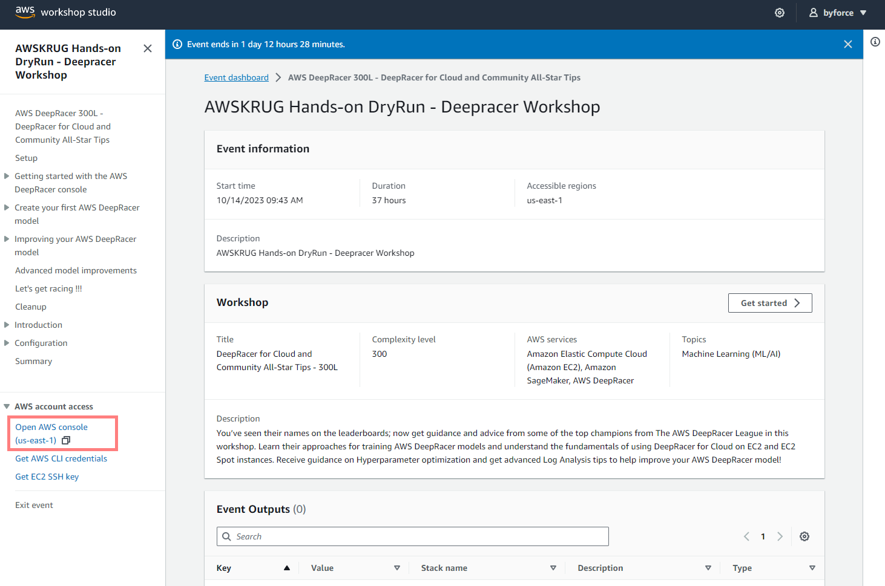
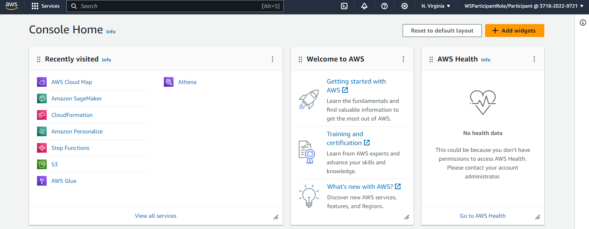
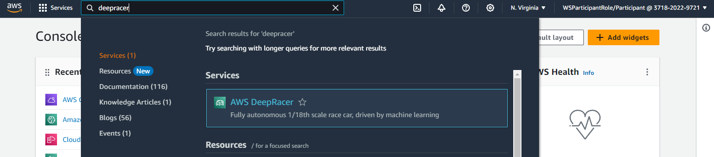

{}
실습 환경을 구성 하기위해 `AWS Workshop Studio` 를 사용합니다.
{}

## Create Account

실습 환경 구성을 위해 제공해 드린 링크에 접속하시면 `AWS Workshop Studio - Sign in` 화면이 나타납니다.

`Email one-time Password (OTP)` 를 클릭하시면 `일회용 이메일 암호` 화면이 나타납니다.

본인의 이메일을 입력하시고 `암호 전송` 을 클릭하시면 `일회용 이메일 암호 입력` 화면이 나타납니다.

메일함을 확인하여 9자리 숫자로 된 `암호` 를 복사하여 입력란에 붙여넣기 하시고 `로그인` 을 클릭하시면 이용 약관에 동의 화면이 나타납니다.

이용 약관에 동의를 위해, `I agree with the Term and Conditions` 에 체크하시고 `Join event` 를 클릭하시면 `AWSKRUG Hands-on - DeepRacer Workshop` 화면이 나타납니다.

우측 메뉴에서 `Open AWS console (us-east-1)` 을 클릭하시면 `AWS Console` 화면이 나타납니다.

`AWS Console` 에 참가자 계정으로 들어왔습니다. 이 계정은 대략 1일 정도만 유지되며, 이후에는 삭제됩니다.

상단 검색창에 `deepracer` 를 입력하시면 `AWS DeepRacer` 가 나타납니다.

